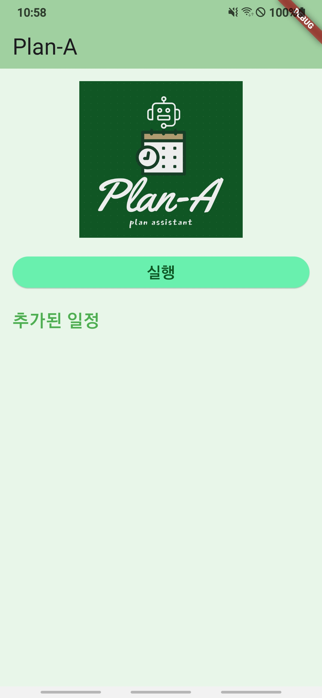

# Plan-A

<p align="center"></p>

AI 핵심기술 기반 실무 프로젝트 1 수업   

통화 음성에서 자동으로 일정을 추출하여 캘린더에 추가해주는 안드로이드 앱  

- 앱을 열고 "실행" 버튼을 누르면 자동으로 오늘자 통화 녹음 파일을 불러와 일정을 분석하고 기본 캘린더에 일정을 추가해줍니다.  
- 추가된 일정에 대한 정보를 앱 화면에 표시해줍니다.  
- 기기의 /storage/emulated/0/Call 경로에 통화 녹음 파일이 저장되어 있다고 가정합니다.

## GPT API 설정

lib 경로에 gpt_api.dart 파일 생성 후 다음과 같이 api 키 입력  
``` dart
const gptApi = '발급 받은 api 키';
```

## Demo

 | | | |
--- | --- | --- | --- |

